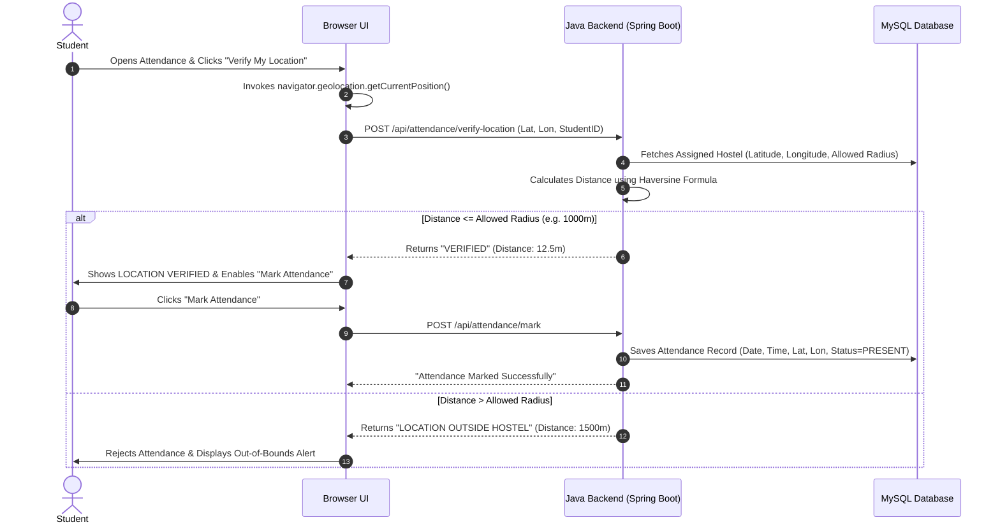

# Smart Hostel Attendance Management System Using Face Recognition and Geolocation

[](https://www.oracle.com/java/)
[](https://spring.io/projects/spring-boot)
[](https://www.mysql.com/)
[](https://developer.mozilla.org/en-US/docs/Web/HTML)
[](https://developer.mozilla.org/en-US/docs/Web/CSS)
[](https://developer.mozilla.org/en-US/docs/Web/JavaScript)

---

## 📖 Project Overview

The **Smart Hostel Attendance Management System Using Face Recognition and Geolocation** is a modern, web-based digital attendance solution designed for college hostel environments. It eliminates cumbersome paper roll-calls by combining secure student identity management with authoritative, real-time GPS coordinate validation.

### 🏛️ Institution & Department Details
* **Institution**: **Adi Shankara Institute of Science and Technology** (Kalady, Ernakulam, Kerala)
* **Program**: **B.Tech Computer Science and Engineering**
* **Department**: **Computer Science and Engineering**
* **Academic Year**: **2023 - 2027**

---

## 🎯 Current Development Phase (50–60% Milestone)

This project represents the core operational foundation (~50–60% milestone) of the complete Smart Hostel ecosystem:

### ✅ Currently Implemented:
1. **Modern Dark Navy / Electric Blue UI**: High-fidelity dashboard, animations, and glassmorphic cards.
2. **Student Registration & Login**: Real Java backend authentication with **BCrypt password hashing**.
3. **College & Hostel Management**: Dynamic profile views and configurable hostel coordinates.
4. **Browser Geolocation API**: High-accuracy GPS capture via `navigator.geolocation`.
5. **Backend Distance Calculation**: Server-side mathematical validation using the **Haversine Formula** (`DistanceCalculator.java`).
6. **Location-Based Attendance Marking**: Prevents proxy attendance and enforces single daily attendance logs.
7. **Attendance History & Analytics**: Logged-in student audit records, percentage calculations, and CSV export.
8. **Java OOP Structure & REST APIs**: Layered architecture using Controllers, Services, Repositories, DTOs, and Models.

### 📌 Future Module — Face Recognition:
* **Face Recognition** is reserved as a **Phase 2 Future Development Module**.
* It is represented in the architecture via the `FaceVerificationService.java` interface abstraction.
* **Important**: Face Recognition is a future module. Biometric verification will be integrated using modern biometric microservices in a future phase.

---

## 🛠️ Technology Stack

* **Backend**: Java 17+, Spring Boot 3, Spring Data JPA, Hibernate, Spring Security Crypto (BCrypt)
* **Frontend**: Semantic HTML5, Vanilla CSS3 (Custom Electric Blue / Dark Glassmorphism Design System), JavaScript (ES6+)
* **Database**: MySQL 8.0 (with H2 in-memory mode for zero-setup local development)
* **Location Verification**: Browser Geolocation API (`navigator.geolocation`), Haversine Algorithm (`DistanceCalculator.java`)
* **Future Biometrics**: `FaceVerificationService` Interface (Future Roadmap Placeholder)

---

## 📐 System Architecture & OOP Principles

```
smart-hostel-attendance/
├── backend/                  # Java Spring Boot Backend
│   ├── src/main/java/com/smarthostel/
│   │   ├── config/           # CORS, Security, Database Seeder
│   │   ├── controller/       # REST API Endpoints
│   │   ├── dto/              # Data Transfer Objects & Requests/Responses
│   │   ├── model/            # JPA Entities (Student, Hostel, Attendance)
│   │   ├── repository/       # Spring Data JPA Interfaces
│   │   ├── service/          # Business Logic & Face Verification Interface
│   │   └── util/             # Haversine DistanceCalculator & PasswordHasher
│   ├── src/main/resources/   # application.properties & MySQL profile
│   └── pom.xml               # Maven Dependencies
├── frontend/                 # Responsive Modern Web UI
│   ├── index.html            # Landing Page
│   ├── login.html            # Student Login Form
│   ├── register.html         # Student Registration Form
│   ├── dashboard.html        # Overview, Stats & Today's Status
│   ├── attendance.html       # GPS Verification & Attendance Marking
│   ├── profile.html          # Student & Adi Shankara College Info
│   ├── history.html          # Attendance Audit Table & CSV Export
│   ├── css/style.css         # Dark Navy + Electric Blue Glassmorphism Theme
│   └── js/                   # Modular Client Scripts (auth, location, config)
├── database/
│   ├── schema.sql            # MySQL Database DDL Scripts
│   └── sample_data.sql       # Safe Campus Seed Data
├── docs/                     # Architecture, REST APIs & Viva Q&A
├── .gitignore
├── .env.example
└── README.md
```

### OOP Concepts Demonstrated
* **Encapsulation**: Private model fields with public accessors and `@JsonIgnore` protection.
* **Abstraction**: `FaceVerificationService` interface separating architectural contracts from future implementations.
* **Separation of Concerns**: Mathematical algorithms (`DistanceCalculator.java`) isolated from web controllers.

---

## 🛰️ How Attendance & Geolocation Verification Works



---

## 🚀 Installation & Setup Guide

### 1. Prerequisites
* **Java Development Kit (JDK 17 or higher)**
* **Apache Maven 3.8+**
* **MySQL Server 8.0+** (Optional: the backend includes an automated in-memory mode for instant testing)
* Modern Web Browser (Chrome, Edge, Firefox, Safari)

---

### 2. Database Setup (MySQL)
1. Log into your MySQL console:
   ```bash
   mysql -u root -p
   ```
2. Execute the schema and seed scripts:
   ```sql
   source database/schema.sql;
   source database/sample_data.sql;
   ```

---

### 3. Backend Setup
1. Navigate to the `backend` directory:
   ```bash
   cd backend
   ```
2. Run the Spring Boot application:
   ```bash
   # Default Mode (Zero-Config In-Memory DB with auto-seeding)
   mvn spring-boot:run

   # OR MySQL Mode (Uses your MySQL database)
   mvn spring-boot:run -Dspring-boot.run.profiles=mysql
   ```
3. The server will start at: `http://localhost:8080`
4. In-memory H2 Console (if using default mode): `http://localhost:8080/h2-console`

---

### 4. Frontend Setup
Open `frontend/index.html` directly in any web browser, or serve it using any local static web server:
```bash
# Option A: Double click frontend/index.html

# Option B: Using Node http-server (if installed)
npx serve frontend -p 3000

# Option C: Using Python simple HTTP server
python -m http.server 3000 --directory frontend
```

---

## 🔑 Demo Login Credentials (Ready to Test)

| Field | Senior Student (No Time Restriction) | 1st-Year Student (9:00 AM - 5:00 PM Window) |
|---|---|---|
| **Student ID** | `ASIET2024CS001` | `ASIET2026CS001` |
| **Email** | `rahul.cs@adishankara.ac.in` | `aditya.cs26@adishankara.ac.in` |
| **Password** | `Password@123` | `Password@123` |
| **Academic Year** | 3rd Year (2023-2027) | 1st Year (2026-2030) |
| **Hostel & Radius** | Main Campus Hostel (1000m Allowed Radius) | Main Campus Hostel (1000m Allowed Radius) |

---

## 🌐 Geolocation Requirements
* **Browser Permission**: You must click **"Allow"** when the browser asks for location access.
* **HTTPS / Localhost**: Modern browsers permit the Geolocation API on `localhost` or over secure HTTPS connections.
* **Viva Presentation Simulator**: The `attendance.html` page includes quick testing controls to simulate both **Inside Hostel (Verified)** and **Outside Hostel (Rejected)** scenarios for college presentations.

---

## 🔮 Future Scope (Phase 2 Roadmap)
1. **Biometric Face Recognition**: Integration of facial biometric matching microservices in Phase 2.
2. **Warden & Admin Analytics Portal**: Comprehensive roll-call heatmaps and absent alert broadcasts.
3. **Automated Parent SMS Notifications**: Instant alerts when a student is absent during evening roll-call.
4. **Multi-Hostel Perimeter Geofencing**: Dynamic polygon-based geofences for large campus layouts.

---

## 📄 License
This project is developed for academic presentation and educational purposes at **Adi Shankara Institute of Science and Technology**.
