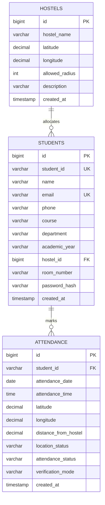

# System Architecture & Java OOP Design

## 1. System Overview
The **Smart Hostel Attendance Management System Using Face Recognition and Geolocation** is architected on a 3-Tier Layered Architecture with clean separation of concerns, robust Object-Oriented Programming (OOP) design, and strict server-side validation.

```
+-------------------------------------------------------------+
|                 PRESENTATION LAYER (HTML5/CSS3/JS)          |
|  - Modern Dark Glassmorphic Dashboard                        |
|  - Browser Geolocation API (`navigator.geolocation`)        |
|  - Real-time Visual Verification & Distance Meters          |
+------------------------------+------------------------------+
                               | REST JSON Requests
                               v
+-------------------------------------------------------------+
|               APPLICATION LAYER (Java Spring Boot)          |
|  Controllers  -> REST Endpoints & Request Mapping           |
|  Services     -> Business Logic, Duplicate Check, Auth       |
|  Utilities    -> Haversine Distance Mathematics, BCrypt     |
|  Model (OOP)  -> Encapsulated Entities (Student, Hostel...) |
+------------------------------+------------------------------+
                               | Spring Data JPA / Hibernate
                               v
+-------------------------------------------------------------+
|                     DATA LAYER (MySQL)                      |
|  - Hostels Table (Configurable Lat/Lon/Radius)             |
|  - Students Table (Credentials, Academic Data)              |
|  - Attendance Table (Geospatial Logs, Statuses)             |
+-------------------------------------------------------------+
```

---

## 2. Java OOP Principles Implemented

### 1. Encapsulation
- All data fields in model classes (`Student.java`, `Hostel.java`, `Attendance.java`) are declared `private`.
- Access and mutations are controlled exclusively through public getters and setters.
- Sensitive fields like `passwordHash` are protected with `@JsonIgnore` annotations.

### 2. Abstraction & Interface Segregation
- `FaceVerificationService.java`: Declares the contract for biometric facial verification planned for future phases without coupling the current codebase to any external library.
- Repository interfaces (`StudentRepository`, `HostelRepository`, `AttendanceRepository`) extend `JpaRepository`, abstracting complex SQL queries into clean Java methods.

### 3. Separation of Concerns (SoC)
- **Mathematical Computation**: Isolated in `DistanceCalculator.java` (pure static utility using Haversine formula).
- **Security & Cryptography**: Handled exclusively in `PasswordHasher.java` via BCrypt.
- **Business Workflows**: Coordinated in `AttendanceService.java` and `AuthService.java`.
- **HTTP Routing**: Managed in `@RestController` classes.

---

## 3. Database Entity-Relationship Diagram (ERD)



---

## 4. Location Verification & Haversine Formula

The backend computes the great-circle distance between the student's GPS coordinate $( \phi_1, \lambda_1 )$ and the hostel coordinate $( \phi_2, \lambda_2 )$:

$$\Delta\phi = \phi_2 - \phi_1, \quad \Delta\lambda = \lambda_2 - \lambda_1$$

$$a = \sin^2\left(\frac{\Delta\phi}{2}\right) + \cos(\phi_1)\cos(\phi_2)\sin^2\left(\frac{\Delta\lambda}{2}\right)$$

$$c = 2 \cdot \text{atan2}\left(\sqrt{a}, \sqrt{1 - a}\right)$$

$$d = R \cdot c \quad (R = 6,371,000 \text{ meters})$$

If $d \le \text{allowedRadius}$, location status is marked **`VERIFIED`**; otherwise **`OUTSIDE_HOSTEL`**.
